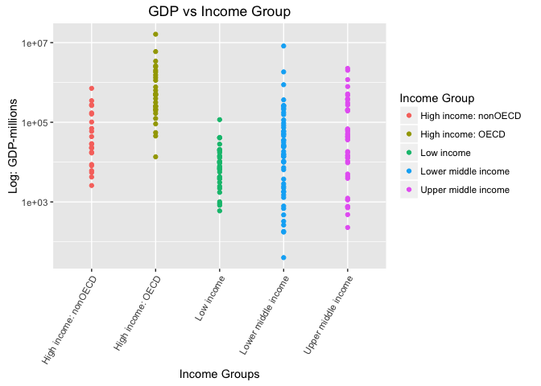

# Case Study 1
Trace Smith  
November 4, 2016  


### Introduction

The objective of this work is to take two separates data files, clean up the data, merge the two data frames, and then conduct various statistical analysis on the final merged data set using R. The raw [`Gross Domestic Product Ranking Table`](http://data.worldbank.org/data-catalog/GDP-ranking-table) data set consists of 327 rows and 10 columns while the [`Education Statistics`](http://data.worldbank.org/data-catalog/ed-stats) contains 31 different features with 234 rows. Both data sets were downloaded from the world bank website and then read into separate data frames. From here, several steps were taken to tidy the data before performing a horizontal merge on the key variable "CountryCode".The source code for tidying and merging the data can be found in `tidy.r` and `merge.r`, respectively. After preprocessing the data, the ultimate goal is to be able to extract information to answer specific questions. The source code to address the following inquiries can be found in the `analysis.r`:

  1. Merge the data based on the country shortcode. How many of the IDs match?
  2. Sort the data frame in ascending order by GDP (so United States is last). What is the 13th
country in the resulting data frame?
  3. What are the average GDP rankings for the "High income: OECD" and "High income:
nonOECD" groups?
  4. Plot the GDP for all of the countries. Use ggplot2 to color your plot by Income Group.
  5. Cut the GDP ranking into 5 separate quantile groups. Make a table versus Income.Group.
  6. How many countries are Lower middle income but among the 38 nations with highest
GDP?

### R Packages

- The listed R packages below are required to execute the source code. If these packages are not installed, you can install the packages by `install.packages("name")` in the R console.


```r
library(plyr)
library(ggplot2)
library(downloader)
```

### Set Working Directory:

**Note:** The working directory should be set to the root node, "Case Study 1":


```r
dir <- "/Users/tracesmith/Desktop/SMU/Github/DoingDataScience/Case Study 1"
setwd(dir)
```

### Downloading the Dataset:

- There are two options when downloading both data sets. First option is shown below where we can specify the URL link to the source and then download the file directly from the website. Furthermore, note that `destfile` refers to directory the file will be stored in along with the name of the file (i.e. GDP.raw.csv). Again, the important piece to remember here is setting the working directory to the root directory: `Case Study 1`.


```r
#Download Data GDP Ranking:
url<-"https://d396qusza40orc.cloudfront.net/getdata%2Fdata%2FEDSTATS_Country.csv"
download(url,destfile="Data/FEDSTATS_Country.raw.csv") #download file and save it to Data directory
```


```r
#Download Educational Data
url<-"https://d396qusza40orc.cloudfront.net/getdata%2Fdata%2FGDP.csv"
download(url,destfile="Data/FGDP.raw.csv")
```


- The second option is to download the file directly from [`The World Bank`](http://www.worldbank.org/) website directly and then move the file from the download directory to the "Data" directory (i.e. a sub-directory of "Case Study 1").


### Tyding the Data

- The following code blocks will walk through the R code utilized to clean up the messy data for each data frame. As a note here, the NA's will not be removed during the cleaning process, rather both empty observations or NA's will be removed later after merging the data together.


#### *Gross Domestic Product Data*

##### Explore the Data:

- In this section, we will take a look at the GDP data set (i.e. `FGDP.raw.csv`). Before transforming the data, let's briefly look at the raw data. First, the downloaded csv file will need to be read into a data frame, which is a convenient way of storing large data sets in a table format. 


```r
#Read GDP Dataset into dataframe
gdp.raw <- read.csv("Data/FGDP.raw.csv",header=TRUE,skip=3)
```


```r
#Dimensions
dim(gdp.raw)
```

```
## [1] 327  10
```

##### Data Cleaning:  

- Before making any changes to the raw data set, let's assign the raw data to `gdp` in order to preserve the initial data set. 


```r
#Assign Raw Data to "gdp"
gdp <-gdp.raw
head(gdp,5)
```

```
##     X Ranking X.1       Economy  US.dollars. X.2 X.3 X.4 X.5 X.6
## 1              NA                                 NA  NA  NA  NA
## 2 USA       1  NA United States  16,244,600       NA  NA  NA  NA
## 3 CHN       2  NA         China   8,227,103       NA  NA  NA  NA
## 4 JPN       3  NA         Japan   5,959,718       NA  NA  NA  NA
## 5 DEU       4  NA       Germany   3,428,131       NA  NA  NA  NA
```

- Next, there a total of 6 columns with missing data (for every observation), thus we will delete these columns. A quick way of dropping these columns would be to assign `NULL` to the respected index column of the "gdp" data frame.


```r
#Drop Columns
gdp[6:10] <-NULL
gdp[[3]] <- NULL
#List the header name for each column
names(gdp)
```

```
## [1] "X"           "Ranking"     "Economy"     "US.dollars."
```

- As shown above in the code block that prints out each column name, the first column is labeled "X1" is actually the "CountryCode", therefore the column will be renamed accordingly. Likewise, the "US.dollars." column of the raw data set will also be renamed to "GDP". 


```r
#Rename Column
colnames(gdp)[1] <- "CountryCode"
colnames(gdp)[4] <- "GDP"
#List the header name for each column
names(gdp)
```

```
## [1] "CountryCode" "Ranking"     "Economy"     "GDP"
```

- Examining the raw data set using the following function, `str(gdp.raw)`, it was noticed that rows 217 and beyond were irrelevant to the analysis (i.e. contained unstructured text information and world GDP statistics) and therefore was excluded from the data frame. 


```r
#Select Certain row and all columns; 
#not including the section of text below the data and world GDP info
gdp<-gdp[(2:216),] #select rows 2:215 and all columns (,)
```

- Columns "Ranking" and "GDP" are both factors and will need to be converted to numeric values in order to perform numerical calculations or any type of analysis. The script to convert these columns to numeric is shown below:


```r
# pattern "[^[:digit:]]" refers to members of the variable name that start with digits. 
# gsub command to replace them with a blank space
# convert variables to numeric 
gdp$GDP <- as.numeric(gsub("[^[:digit:]]","", gdp$GDP))
gdp$Ranking <- as.numeric(gsub("[^[:digit:]]","", gdp$Ranking))
```

- In this code block, the output will allow us to look over the data frame and make sure everything looks correct before moving forward.


```r
#Check everything looks correct:
head(gdp,5)
```

```
##   CountryCode Ranking       Economy      GDP
## 2         USA       1 United States 16244600
## 3         CHN       2         China  8227103
## 4         JPN       3         Japan  5959718
## 5         DEU       4       Germany  3428131
## 6         FRA       5        France  2612878
```

- Before removing any rows containing `NA` for the "Ranking" column, the code below will count the total number of NA observations per each column.


```r
#The number of N/A per column
head(colSums(is.na(gdp)))
```

```
## CountryCode     Ranking     Economy         GDP 
##           0          25           0          25
```

#### *Educational Data Set*

#####Explore the Data:

- Now, let's take a look at the Educational data (i.e. `FEDSTATS_Country.raw`). Likewise, the downloaded csv file will be read into a data frame; note the raw data file will be preserved by assigning it to a new data frame "fedstats". The dimensions of the data file and the column headers are shown below. 


```r
#Read FEDSTATS Dataset into datframe
fedstats.raw <- read.csv("Data/FEDSTATS_Country.raw.csv",header=TRUE)
#Create New DataFrame From Raw
fedstats<-fedstats.raw
```


```r
#Dimensions (row,columns)
dim(fedstats.raw)
```

```
## [1] 234  31
```

- The output from this code block will return the column name of each feature and the corresponding number of observations containing NA (per column). 


```r
#The number of N/A per column
colSums(is.na(fedstats))
```

```
##                                       CountryCode 
##                                                 0 
##                                         Long.Name 
##                                                 0 
##                                      Income.Group 
##                                                 0 
##                                            Region 
##                                                 0 
##                                  Lending.category 
##                                                 0 
##                                      Other.groups 
##                                                 0 
##                                     Currency.Unit 
##                                                 0 
##                          Latest.population.census 
##                                                 0 
##                           Latest.household.survey 
##                                                 0 
##                                     Special.Notes 
##                                                 0 
##                       National.accounts.base.year 
##                                                 0 
##                  National.accounts.reference.year 
##                                               197 
##                       System.of.National.Accounts 
##                                               149 
##                               SNA.price.valuation 
##                                                 0 
##                     Alternative.conversion.factor 
##                                                 0 
##                                   PPP.survey.year 
##                                                89 
##                 Balance.of.Payments.Manual.in.use 
##                                                 0 
##                    External.debt.Reporting.status 
##                                                 0 
##                                   System.of.trade 
##                                                 0 
##                     Government.Accounting.concept 
##                                                 0 
##                   IMF.data.dissemination.standard 
##                                                 0 
## Source.of.most.recent.Income.and.expenditure.data 
##                                                 0 
##                       Vital.registration.complete 
##                                                 0 
##                        Latest.agricultural.census 
##                                                 0 
##                            Latest.industrial.data 
##                                               139 
##                                 Latest.trade.data 
##                                                46 
##                      Latest.water.withdrawal.data 
##                                                82 
##                                     X2.alpha.code 
##                                                 1 
##                                         WB.2.code 
##                                                 1 
##                                        Table.Name 
##                                                 0 
##                                        Short.Name 
##                                                 0
```


##### Data Cleaning: 
- For this data set, there were no necessary tidying procedures performed. However, given that the primary columns of interest are "CountryCode", "Long.Name", and "Income.Group", the remaining attributes will be dropped from the data frame. 


```r
#Drop column index 4 thru the number of columns in the df
fedstats[4:ncol(fedstats)] <-NULL
```

A look at the first five rows of the educational data frame with each attribute is shown below. 

```r
#Display the first 5 rows of dataframe
head(fedstats,5)
```

```
##   CountryCode                    Long.Name         Income.Group
## 1         ABW                        Aruba High income: nonOECD
## 2         ADO      Principality of Andorra High income: nonOECD
## 3         AFG Islamic State of Afghanistan           Low income
## 4         AGO  People's Republic of Angola  Lower middle income
## 5         ALB          Republic of Albania  Upper middle income
```

### Merge Data

- Now that both data frames, Gross Domestic Product and Educational data, is cleaned and ready to merge, the unique ID column that will be the key to merge the data on is "CountryCode". The merge data set will be named "merge.gdp.fedstats".


```r
#merge data on country shortcode
merge.gdp.fedstats <- merge(gdp,fedstats,by="CountryCode")
```

- The initial column indexes are from 1:6, however for interpretability purposes, the position of these columns have been re-ordered accordingly: 


```r
#Change the order of the columns:
merge.gdp.fedstats <-merge.gdp.fedstats[c(1,3,5,4,6,2)]
head(merge.gdp.fedstats,5)
```

```
##   CountryCode     Economy                    Long.Name    GDP
## 1         ABW       Aruba                        Aruba   2584
## 2         ADO     Andorra      Principality of Andorra     NA
## 3         AFG Afghanistan Islamic State of Afghanistan  20497
## 4         AGO      Angola  People's Republic of Angola 114147
## 5         ALB     Albania          Republic of Albania  12648
##           Income.Group Ranking
## 1 High income: nonOECD     161
## 2 High income: nonOECD      NA
## 3           Low income     105
## 4  Lower middle income      60
## 5  Upper middle income     125
```

- Note that the answers to the analysis questions in the following section is based on removing the each observation with NA in the "Ranking" column. Thus, the **merge.data.final** data frame will be referenced in the `analysis.r` file.


```r
#replace any blank observations with N/A
merge.gdp.fedstats[merge.gdp.fedstats == ""] <- NA
```


```r
#Remove any Rows Wth NA's
merge.data.final<-merge.gdp.fedstats[!(is.na(merge.gdp.fedstats$Ranking)), ]
```

##### Final Merged Data Frame 


```r
#Display the first 5 rows of dataframe
head(merge.data.final,5)
```

```
##   CountryCode              Economy                    Long.Name    GDP
## 1         ABW                Aruba                        Aruba   2584
## 3         AFG          Afghanistan Islamic State of Afghanistan  20497
## 4         AGO               Angola  People's Republic of Angola 114147
## 5         ALB              Albania          Republic of Albania  12648
## 6         ARE United Arab Emirates         United Arab Emirates 348595
##           Income.Group Ranking
## 1 High income: nonOECD     161
## 3           Low income     105
## 4  Lower middle income      60
## 5  Upper middle income     125
## 6 High income: nonOECD      32
```


### Statistical Analysis

**Question #1: Merge the data based on the country shortcode. How many of the IDs match?**


- After merging the data set, the number of matches can be determined either by visually examining the number of rows in the `merge.gdp.fedstats` data frame or by simply counting the number of matches between the fedstats and gdp data frames by the unique identifier "CountryCode" using the [`intersect`](https://stat.ethz.ch/R-manual/R-devel/library/base/html/sets.html) function shown below.


```r
# Counts the total mataches between fedstats and gpd when merging on 
# CountryCode
print(paste0("Total Number of ID Matches: ",
             length(intersect(fedstats$CountryCode,gdp$CountryCode)))) 
```

```
## [1] "Total Number of ID Matches: 210"
```

- The total number of matches after removing the NA's in the "Ranking" column in the "merge.data.final" data frame.


```r
# Dimensions of the data frame
dim(merge.data.final)
```

```
## [1] 189   7
```

**Question #2: Sort the data frame in ascending order by GDP (so United States is last). What is the 13th country in the resulting data frame?**

- The 13th ranked country (in ascending order) of the GDP ranking is shown below:


```r
#Sort merged data frame by ascending order
sort.gdp <-merge.data.final[order(merge.data.final$GDP,decreasing=FALSE,na.last = TRUE),][12:13,] # select rows 12-13 and all columns (tie between rankings)
sort.gdp[,c("CountryCode","Long.Name","Ranking","GDP")]
```

```
##     CountryCode           Long.Name Ranking GDP
## 75          GRD             Grenada     178 767
## 102         KNA St. Kitts and Nevis     178 767
```

**Question #3: What are the average GDP rankings for the "High income: OECD" and "High income: nonOECD" groups?**

- For this question, the merged data set was grouped by "Income.Group" and then the average of the "Ranking" column was taken for the respected groups. The first five rows of the aggregated data frame are shown below:


```r
#Aggregrate data frame by Income.Group and take the mean rankings
merge.data.agg <- ddply(merge.data.final, .(Income.Group), summarize,  Ranking=mean(Ranking))
head(merge.data.agg,5)
```

```
##           Income.Group   Ranking
## 1 High income: nonOECD  91.91304
## 2    High income: OECD  32.96667
## 3           Low income 133.72973
## 4  Lower middle income 107.70370
## 5  Upper middle income  92.13333
```

**Question #4: Plot the GDP for all of the countries. Use ggplot2 to color your plot by Income Group.**


```r
#Create a scatter plot using ggplot2 to plot Income.Group vs GDP (merged data frame)
p<-ggplot(merge.data.final)+ geom_point(aes(y=GDP,x=Income.Group,colour=Income.Group)) +scale_y_log10() #change y axis to log scale
p+labs(title="GDP vs Income Group", # add title
       x="Income Groups",y="Log: GDP-millions",colour="Income Group") + #name labels
  theme(axis.text.x = element_text(angle = 60, hjust = 1)) #adjust the x-axis labels (rotate)
```

<!-- -->

**Question #5: Cut the GDP ranking into 5 separate quantile groups. Make a table versus Income.Group. How many countries are Lower middle income but among the 38 nations with highest GDP?**

- The cut function divides a numeric vector in different ranges. The total number of break points to apply to the "merge.data.final$Ranking" column is 5, which represents the different quantiles. The quantile ranges associated with each "merge.data.final$Income.Group" is listed in the table below.


```r
#convert Ranking column into numeric -- initially a factor
merge.data.final$Ranking <- as.numeric(as.character(merge.data.final$Ranking))
#divide the numeric vector into 5 break points (i.e. quantiles)
merge.data.final$Group <- cut(merge.data.final$Ranking,breaks=5)
#take the quantiles and income.group from the merge data file and create a table
quant.table<-table(merge.data.final$Income.Group, merge.data.final$Group)
quant.table
```

```
##                       
##                        (0.811,38.8] (38.8,76.6] (76.6,114] (114,152]
##                                   0           0          0         0
##   High income: nonOECD            4           5          8         4
##   High income: OECD              18          10          1         1
##   Low income                      0           1          9        16
##   Lower middle income             5          13         12         8
##   Upper middle income            11           9          8         8
##                       
##                        (152,190]
##                                0
##   High income: nonOECD         2
##   High income: OECD            0
##   Low income                  11
##   Lower middle income         16
##   Upper middle income          9
```

### Conclusion

- In summary, this primary objective of this work is to take unstructured data files, tidy up the data, merge the data frames, and perform some analysis on the final data set. As Data Scientist, it is very rare to receive perfectly formatted data. Data comes in all forms and often the time it is very messy. The workflow discussed in this Case Study is a practical example of writing several scripts in R to clean a messy data set before performing any statistical analysis. 


### Reference:
Adapted from the Case Study Report Help website of the University of New South Wales School of Engineering: [Link](https://student.unsw.edu.au/writing-case-study)
