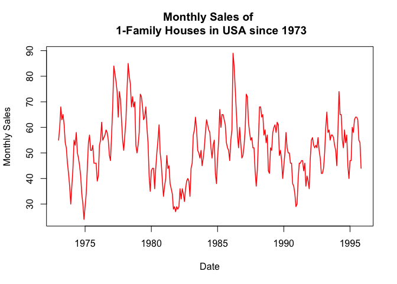
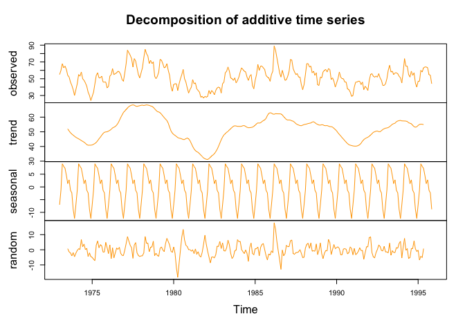
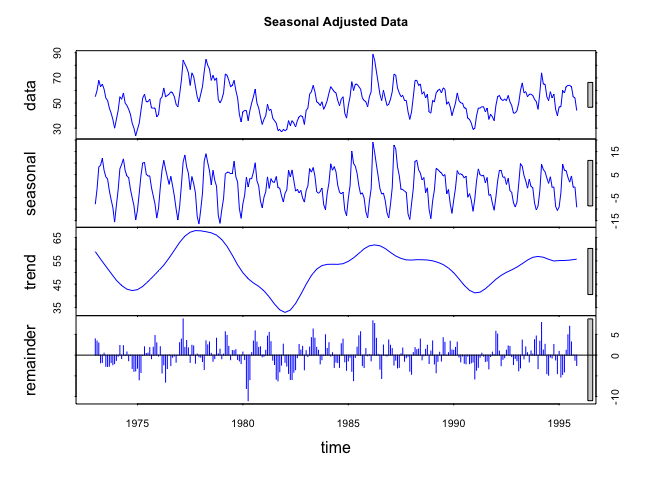
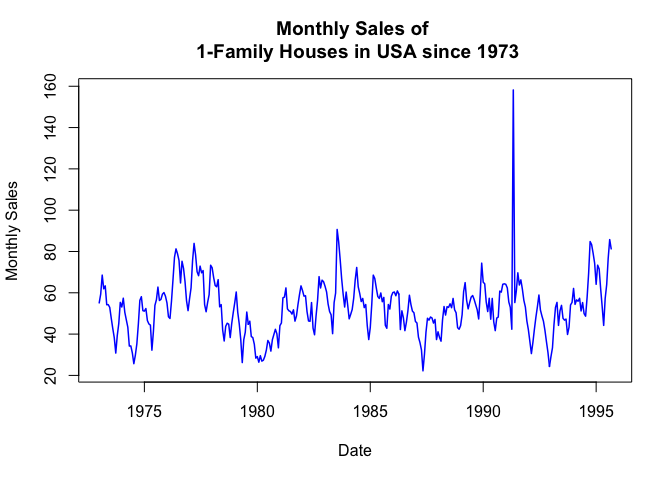
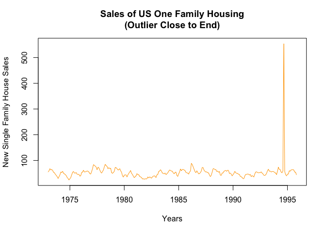
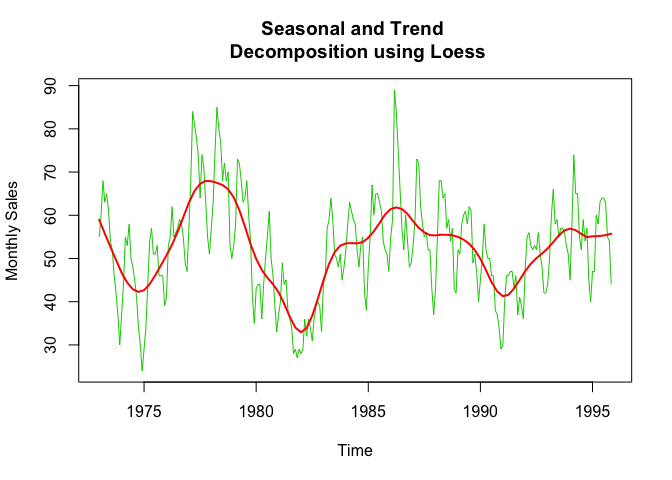

# Live Unit 11 Assignment
Angela Horacek, James Gage, Trace Smith  
11/17/2016  
<br>


- The data for this assignment is loaded from the 'Forecasting: principles and practice' (i.e. fpp) library. The source for the data 'hsales' which is the monthly sales of new one-family houses sold in the USA since 1973 is from: "Makridakis, Wheelwright and Hyndman (1998) Forecasting: methods and applications, John Wiley & Sons: New York. Chapter 3."


a.) Plot the time series. Can you identify seasonal fluctuations and/or a trend? 


```r
#plot the monthly sales of homes:
plot(hsales, col="red", lwd=1.5, ylab = "Monthly Sales", xlab="Date",
    main="Monthly Sales of \n 1-Family Houses in USA since 1973")
```

<!-- -->

b.) Use a classical decomposition to calculate the trend-cycle and seasonal indices. 


```r
#Decompose a time series into seasonal, trend and irregular 
#components using moving averages.
data <- decompose(hsales)
```


```r
# Plot the estimated trend, seasonal, and irregular components
plot(data, col="orange")
```

<!-- -->

c.) Do the results support the graphical interpretation from part (a)? 


d) Compute and plot the seasonally adjusted data. 


```r
#Plot the seasonlly adjusted data:
adj_sales <- seasadj(data)
plot(adj_sales, col="blue", lwd=1.5, ylab = "Monthly Sales", xlab="Date",
     main="Monthly Sales of \n 1-Family Houses in USA since 1973")
```

<!-- -->

e) Change one observation to be an outlier (e.g., add 500 to one observation), and recompute the seasonally adjusted data. What is the effect of the outlier? 


```r
#add outlier to data
#ts is used to create time-series objects
hsales3 <- ts(c(hsales[1:275],hsales[5]+100), end=c(1995,11),
              start=c(1973,1),frequency=15)
```


```r
plot(hsales3,col="purple",lwd=1.5,
     main="Modify 'hsales' Data with Outlier",
     xlab = "Time", ylab="Monthly Sales")
```

<!-- -->


```r
data3 <- decompose(hsales3)
adj_sales3 <- seasadj(data3)
```


```r
#Plot the seasonlly adjusted data with outlier:
plot(adj_sales3, col="blue", lwd=1.5, ylab = "Monthly Sales", xlab="Date",
     main="Monthly Sales of \n 1-Family Houses in USA since 1973")
```

<!-- -->

f) Does it make any difference if the outlier is near the end rather than in the middle of the time series? 

g) Now use STL to decompose the series.


```r
#STL Decomposition
fit <- stl(hsales,s.window = 5)
plot(fit,col="blue")
```

<!-- -->

```r
plot(hsales,col="green3",main="Seasonal and Trend \n Decomposition using Loess",
      ylab="Monthly Sales",xlab="Time")
lines(fit$time.series[,2],col="red",lwd=2,ylab="Trend")
```

<!-- -->
